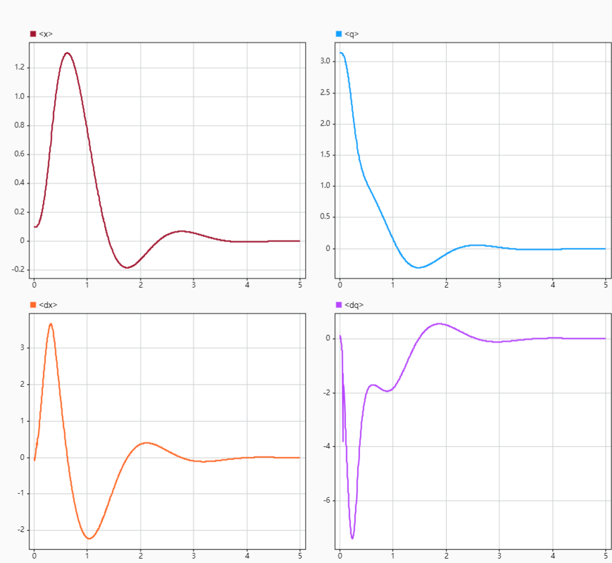

# CartPoleMPC
Employ acados to compute Model Predictive Control (MPC) for the regulation of a cart-pole system, which is simulated using Simscape within the Simulink environment. 

# Dependencies

* acados
* MATLAB
* Simulink
* Simscape

# Install

1. Install acados for MATLAB by the [documentation](https://docs.acados.org/matlab_octave_interface/index.html). Before running the code in this repository, make sure you can run the [examples](https://github.com/acados/acados/tree/master/examples/acados_matlab_octave/getting_started) provided by acados without any error.

2. Clone the repository

```bash
git clone https://github.com/zitongbai/CartPoleMPC
```

# Usage

1. Change `acados_dir` in `add_acados_path.m` to the path of acados in your computer.

2. Run `acadosCartPoleMPC.m` in MATLAB to run MPC once to create the s function used in Simulink. 

3. Open `acadosSim.slx` in Simulink and run the simulation.

You need to change the view direction in Mechanics Explorer to see the cart-pole system.




# Some notes

1. The parameters for the simscape model is stored in the **Model Workspace** inside the simulink. 

2. The mask of S-Function block in the simulink is employed so that the names of input and output ports can be seen. 
